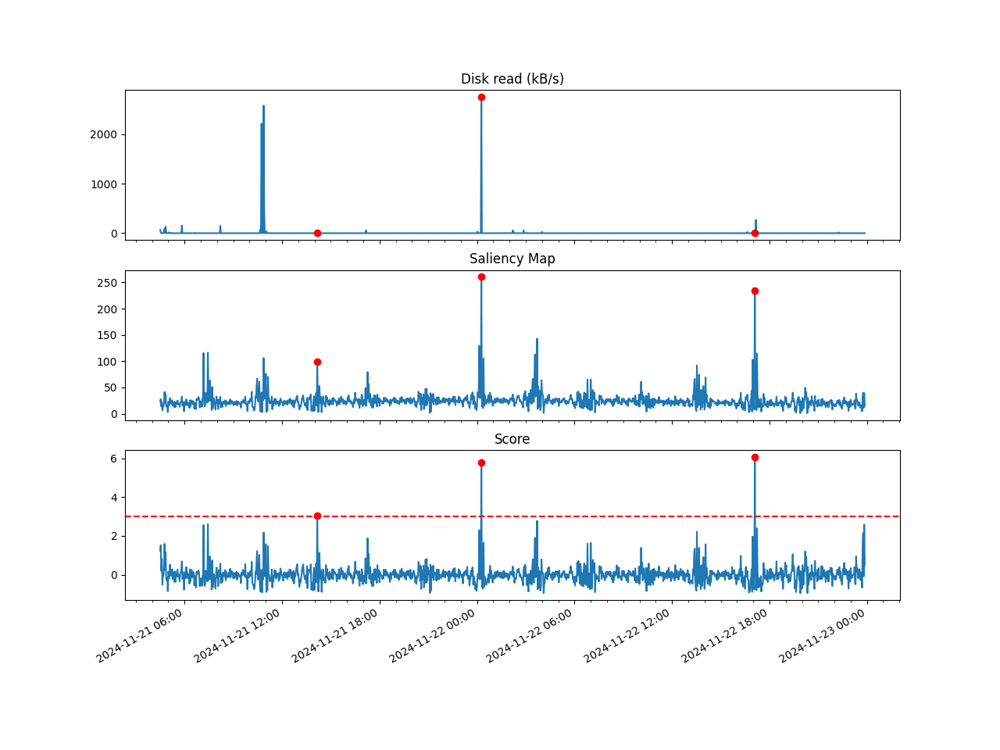

Anomaly Detection using Spectral Residual in Rust
=================================================

An implementation of anomaly detection based on Spectral Residual method in Rust.

## References

1. [Time-Series Anomaly Detection Service at Microsoft](https://dl.acm.org/doi/10.1145/3292500.3330680) Hansheng Ren, et al. (KDD 2019)
2. [Saliency Detection: A Spectral Residual Approach](https://ieeexplore.ieee.org/document/4270292) Xiaodi Hou, Liqing Zhang (CVPR 2007)


## Implementation

The paper [1] proposes the anomaly detection algorithm for time-series data based on Spectral Residual method [2] and combines it with convolutional neural network (SR-CNN).

However, this app implements SR-based method only, it means that this has no CNN for now.


## CLI Usage

```
$ cargo run -- --help
Usage: anomaly_detector [OPTIONS] [PATH]

Arguments:
  [PATH]  Path to the input CSV file. If not provided or "-", it reads from the standard input

Options:
  -q, --q <Q>  Window size for calculating a saliency map [default: 3]
  -z, --z <Z>  Window size for calculating the average of the saliency map which is used for scoring [default: 21]
  -t, --t <T>  Threshold that determines if a data point is an anomaly [default: 3.0]
  -m, --m <M>  Number of preceding points considered for extrapolation [default: 5]
  -k, --k <K>  Number of extrapolated points. 0 for disabling extrapolation [default: 5]
  -h, --help   Print help
```

## Input/Output

An input should be a CSV with `Time`, timestamp in milliseconds, and `value` columns:

```csv
"Time","value"
1734790270000,1234.5
1734790280000,6789.0
1734790290000,1234.5
```

An output will be a csv with 5 columns:

```csv
Time,value,saliency,score,output
2024-11-27 16:40:00,0,11.321497,0.8959884,0
2024-11-27 16:45:00,0,11.463924,0.7604108,0
2024-11-27 16:50:00,0,11.481833,0.62961555,0
```

`Time` and `value` are the same as the input. `saliency` and `score` are values of saliency map and score at that time, respectively. `output` is a result of detection. `1` means it's an anomaly.


## Draw Graph

A program to draw result graph is available at `drawer`. It's a Python project :(

```
$ uv run main.py detection_result.csv -o result.png -t 3.0
```

An output sample is here:




## Remarks

This work is a part of urandom vol.13, computer security fanzine, published at Comic Market 105 (2024-12-30).


## License

This program is licensed under the MIT license.
